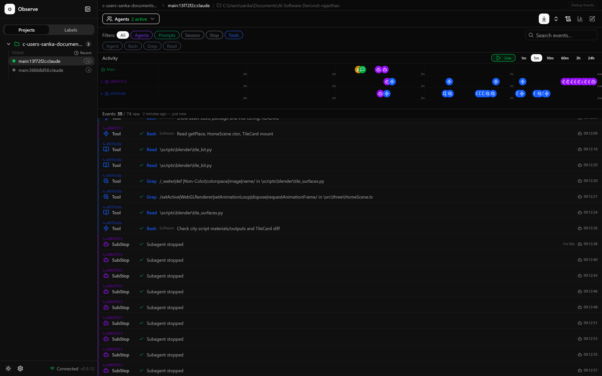
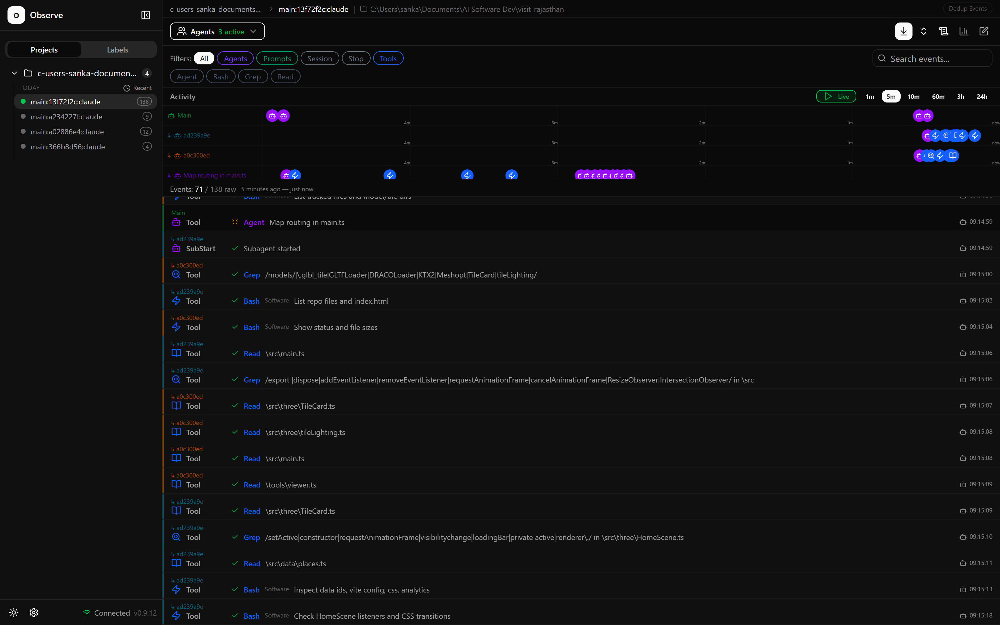

# Day 2 — Hook + Agent Observability

Built against the **visit-rajasthan** codebase (Vite + TypeScript + Three.js, with
Blender-generated `.glb` tiles).

Deliverables:

1. Four working hooks — [`.claude/hooks/`](../.claude/hooks/), wired in [`.claude/settings.json`](../.claude/settings.json)
2. A test suite proving each fires on the right event — [`tests/hooks.test.mjs`](../tests/hooks.test.mjs)
3. Screenshots of observed subagent activity — [`docs/observability/`](observability/)

---

## 1. The hooks

Full reference: [`.claude/hooks/README.md`](../.claude/hooks/README.md).

| Hook                     | Event                            | Purpose                                                                                                         |
| ------------------------ | -------------------------------- | --------------------------------------------------------------------------------------------------------------- |
| `guard-locked-files.mjs` | `PreToolUse`                     | Blocks edits to locked config (`package.json`, `tsconfig.json`, `vite.config.ts`, `.github/workflows/*.yml`, …) |
| `format-after-edit.mjs`  | `PostToolUse`                    | Runs Prettier on every file Claude writes                                                                       |
| `test-after-commit.mjs`  | `PostToolUse`                    | Runs the test suite after every `git commit`                                                                    |
| `log-subagent.mjs`       | `SubagentStart` / `SubagentStop` | Records subagent lifecycle to `.claude/logs/subagents.jsonl`                                                    |

The first three are the three examples from the brief. The fourth is the in-repo
counterpart to the observability half of this task — a durable record of what the
dashboard shows live.

All four are registered in **exec form** (`"command": "node"`, `"args": [...]`).
On Windows that avoids the shell entirely, which matters here because the project
path contains spaces (`C:\Users\sanka\Documents\AI Software Dev\...`).

## 2. Test case: proving each hook fires on the right event

```bash
npm test
```

```
✔ guard-locked-files (PreToolUse)
✔ format-after-edit (PostToolUse)
✔ test-after-commit (PostToolUse)
✔ log-subagent (SubagentStart / SubagentStop)
✔ places data
ℹ tests 27
ℹ suites 5
ℹ pass 27
ℹ fail 0
```

`tests/hooks.test.mjs` drives each hook exactly the way Claude Code does — spawn the
script, pipe a hook event JSON on stdin, assert on stdout, stderr and the exit code.
Nothing is mocked, so a green run means the real hook works.

Every hook is tested from **both** sides — that it fires on its own event, and that
it stays quiet on everything else:

| Hook         | Fires on                                                                                                                                       | Stays silent on                                                                                                                           |
| ------------ | ---------------------------------------------------------------------------------------------------------------------------------------------- | ----------------------------------------------------------------------------------------------------------------------------------------- |
| guard        | `Write` to `package.json`; glob hit on `.github/workflows/deploy.yml`; `echo … > vite.config.ts`; `sed -i … tsconfig.json`; `tee package.json` | `src/**` edits; `cat`/`grep` of a locked file; `npm run build`; `Read`; `VR_ALLOW_LOCKED_EDITS=1`                                         |
| format       | badly formatted `.ts` → rewritten on disk + `additionalContext` returned                                                                       | already-formatted files; `.glb`; `dist/**`; non-edit tools                                                                                |
| post-commit  | `git commit -m …`; `git -C . commit …`; `git add -A && git commit …`                                                                           | `git status`; `git log --oneline`; `git show --format=%H`; `git commit --dry-run`; `npm run commit-helper`; empty commits; non-Bash tools |
| subagent log | `SubagentStart` + `SubagentStop` → JSONL line each                                                                                             | `PreToolUse` (no log file created at all)                                                                                                 |

`tests/places.test.mjs` adds five real content checks on the four destinations
(every `hero`/`tile`/`tilePoster` asset resolves under `public/`, accents are valid
hex, `getPlace` routing works) — so the post-commit hook is guarding something that
actually matters, not just guarding itself.

### Live proof, outside the test suite

The hooks were also exercised by real headless Claude Code sessions in this repo.

**Guard** — asked a session to bump the version in `package.json`:

> I didn't change the version. A PreToolUse hook blocked the edit to `package.json`,
> and this is the exact reason it gave:
>
> > Blocked by the locked-files hook: package.json is protected.
> > Build and deploy config for visit-rajasthan is human-owned. […]
> > Locked paths live in .claude/locked-files.json. If this edit is genuinely
> > intended, ask the user to make it, or re-run with VR_ALLOW_LOCKED_EDITS=1.

`package.json` was unchanged afterwards.

**Formatter** — asked a session to write `src/scratch-format-demo.ts` containing
exactly `const   demo='jaipur'   ;` / `export    {demo}`:

> I created the file with your two lines exactly as written, but it doesn't contain
> them anymore. A post-write hook […] ran Prettier on the file straight after I
> saved it.

On disk: `const demo = "jaipur";` / `export { demo };` (scratch file since removed).

**Post-commit** — running the hook directly with a red suite exits 2 and hands the
failure back to the agent:

```
$ echo '{"tool_name":"Bash","tool_input":{"command":"git commit -m \"break it\""}, …}' \
    | node .claude/hooks/test-after-commit.mjs
Post-commit hook: the test suite FAILED after your commit.
The commit exists but the tree is red — fix it before doing anything else.
✖ fixture suite fails on purpose
…
HOOK_EXIT=2
```

## 3. Agent observability

Tool: [agents-observe](https://github.com/simple10/agents-observe) v0.9.12.

### Setup

```bash
claude plugin marketplace add simple10/agents-observe
claude plugin install agents-observe@agents-observe

# Docker Desktop must be running first — the plugin's autostart fails silently
# against a cold daemon, so the image was pulled explicitly:
docker pull ghcr.io/simple10/agents-observe:v0.9.12

node "$PLUGIN/hooks/scripts/observe_cli.mjs" start
# Dashboard: http://127.0.0.1:4981
```

The plugin registers its own hooks on every Claude Code event and POSTs each one to
a local server, which stores them in SQLite and streams them to a React dashboard
over WebSocket. Session deep link: `http://127.0.0.1:4981/#/_/<session-id>`.

### Spawning the subagents

```bash
claude -p "Use the Explore subagent (very thorough) to investigate how the
Blender-built .glb tiles in public/models are loaded, lit, and rendered on the
Places grid of this site. Then use a second Explore subagent (medium breadth) to
map how routing and page rendering work in src/main.ts. Summarise both findings."
```

### Screenshots

**Two Explore subagents running in parallel** — separate swim lanes per agent, and
each event in the feed attributed to the agent that produced it:



**Parent → child spawn, captured live** — `Main` fires the `Agent` tool
("Map routing in main.ts"), the child's `SubStart` lands immediately after, and from
there the `Grep` / `Read` / `Bash` calls of both subagents interleave under their own
colour-coded IDs:



Screenshots were captured with [`scripts/capture-observe-screenshot.mjs`](../scripts/capture-observe-screenshot.mjs):

```bash
node scripts/capture-observe-screenshot.mjs <session-id> [outfile]
```

### The same run, seen by our own hook

`log-subagent.mjs` recorded the same lifecycle independently, in `.claude/logs/subagents.jsonl`:

```json
{"ts":"2026-09-23T03:40:32.608Z","event":"SubagentStart","agent_type":"Explore","agent_id":"afd7bc8a228de514f","session_id":"13f72f2c-…"}
{"ts":"2026-09-23T03:40:37.123Z","event":"SubagentStart","agent_type":"Explore","agent_id":"a96d7613a91528c3c","session_id":"13f72f2c-…"}
{"ts":"2026-09-23T03:42:37.820Z","event":"SubagentStop","agent_type":"Explore","agent_id":"a96d7613a91528c3c","session_id":"13f72f2c-…"}
```

## 4. Things worth knowing

- **`SubagentStop` is not one-shot.** It fires once per subagent _turn_. One Explore
  agent produced nine `SubagentStop` events. Use `SubagentStart` as the spawn
  signal and de-duplicate stops by `agent_id`.
- **Hooks do not load into a session that is already running.** Both the project
  hooks and the agents-observe plugin hooks only took effect in sessions started
  after they were written — which is why the proofs above use fresh `claude -p` runs.
- **`node --test` needs a glob, not a directory.** `node --test tests/` fails on
  Node 24 with `Cannot find module …/tests`; `node --test "tests/**/*.test.mjs"`
  works. Forward slashes are fine on Windows since Node expands the pattern itself.
- **`NODE_TEST_CONTEXT` leaks into child processes.** A hook that shells out to
  `node --test` while itself running under `node --test` inherits this variable, which
  puts the child in child-process reporter mode and swallows its exit code — a red
  suite silently reports green. `test-after-commit.mjs` deletes it before spawning.
- **A hook that blocks writes does not block a determined agent.** After the
  formatter rewrote its file, the session volunteered that it could "write it with a
  shell command, which the hook won't catch". `guard-locked-files` covers the common
  shell write forms for exactly this reason, but regex is not a parser. These hooks
  raise the cost of an accident; they are not a security boundary.
